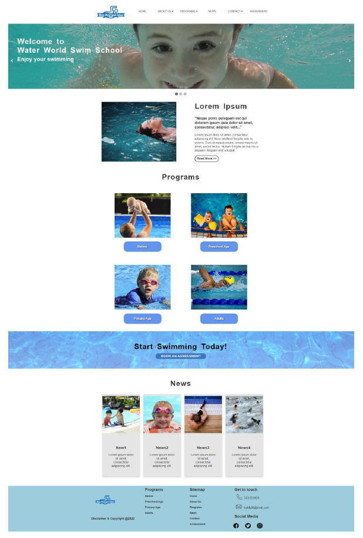

# Assignment-1-Design-and-build-a-website

## 1.	Project Overview
Water World Swim School needs a new modern website to provide information about the swimming programs for infants, children, and adults. The website is also a platform for customers to communicate with the swim school and instructors.  

## 2.  Project Objectives 
One of the main objectives of this project is to attract new customers and improve current customer satisfaction on the website. The website will have five specific pages on it. It consists of a Homepage, About Us, Swimming Programs, News, a Contact page, and three dynamic subpages. 

## 3. Website Functionality and Features
#### Static pages
* The homepage is where all the action happens on the website.
* About Us, the page elaborates on the swim school's vision and accomplishments.
* The Programs page is about how the swim school delivers swimming lessons. 
* The News page will feature the upcoming events and notifications for the swim school. 
* Visitors can find the swim school's physical address, email and contact details. 
* Bookn an assessment before joining the swimming program.
#### Dynamic pages
* The images will change automatically and can also be changed manually by users. 
* The gallery displays the swim school environment and students’ activities, which can be enlarged on the Gallery page.
* The Testimonials can be shown when the user’s mouse enters and disappears when it leaves. 
* Users can choose their rating and send reviews on the Feedback page.

## 4. Wireframes
#### Homepage

#### About Us 

## 5. Screenshots of the website
#### Homepage

#### About Us

### Assessment Booking Form

